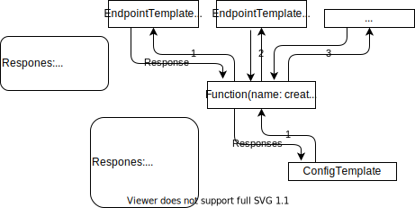

# Parameters
Is a Structure of Parameters to be used with the go tenmplating in ConfigTemplate, Function or EndpointTemplate.  
The Structure consists of two sections `Parameters` and `Responses`.  
The Parameters section is templated by the given parameter definition at the call of the Function or EndpointTemplate.  
The Responses section is availabe upstream of the EndpointTemplate call. And can be used in the parameter definition over the go templating.  
